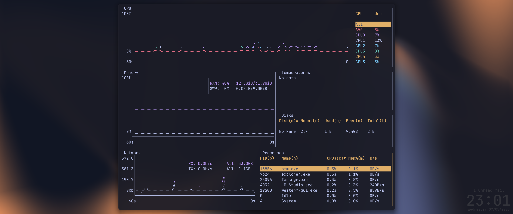
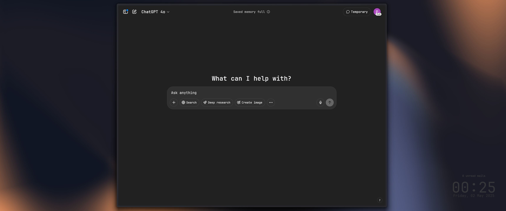
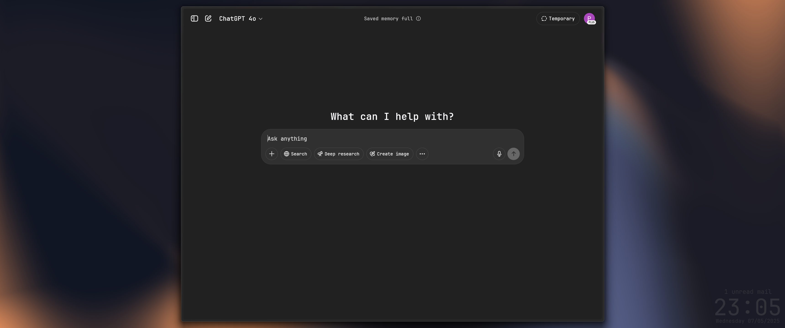

# Dotfiles++

## Overview
This repository contains configuration files for customizing Windows with a "minimal" setup.

## Main Components
- **WezTerm** - Terminal emulator
- **PowerShell** - Shell environment
- **Neovim** - Text editor
- **Python 3.13.3**
  - PyQt5
  - imapclient
  - psutil
  - keyboard
  - pywin32

## Setup
- PowerShell profile with symlink
- Neovim config with symlink
- Scripts run at Windows startup
- 2 custom Python tools for gui customisation
  - Window manager
  - Hud

## Features
- Python implementation of rain meter like hud framework
- Python window manager that handles window tagging and pixel perfect adjustments when snapping to zones

## General tips for WIN11 (mandatory ;))

search files

https://www.voidtools.com/

everything and es-cli
